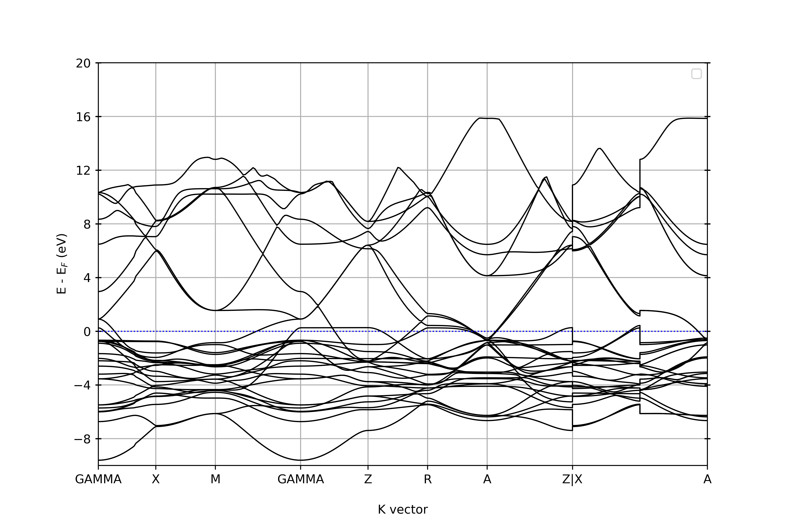
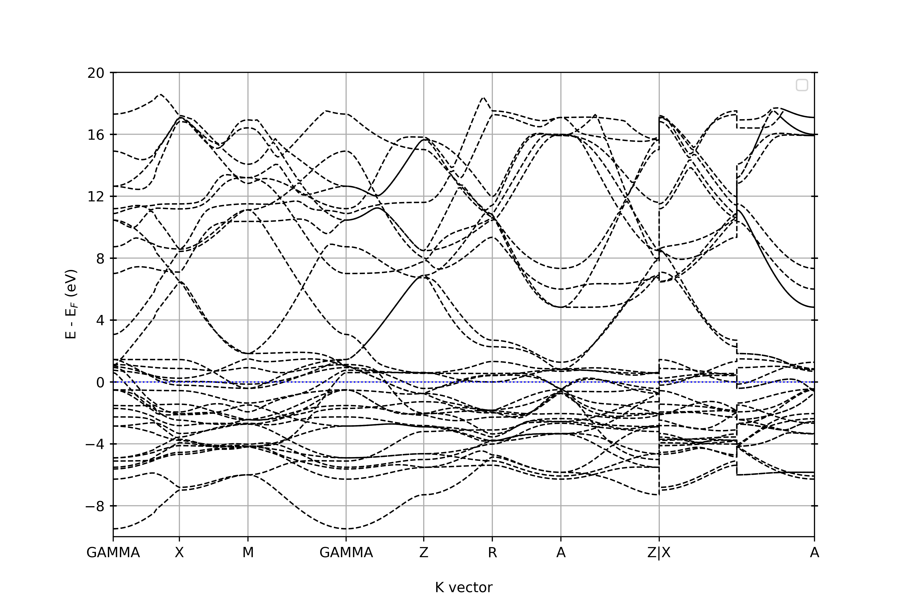
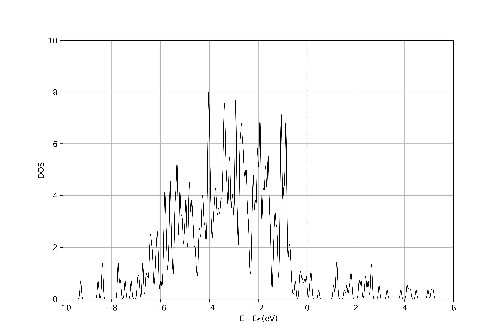
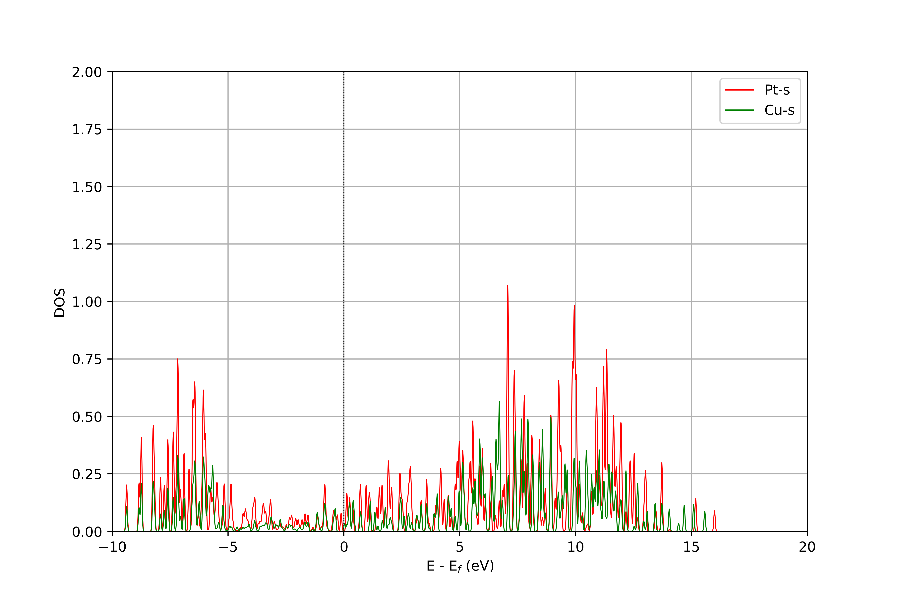
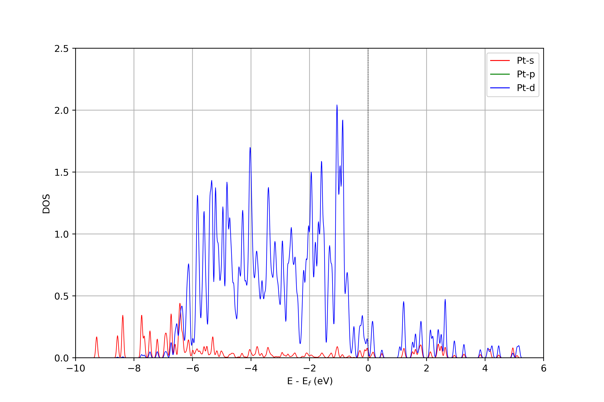
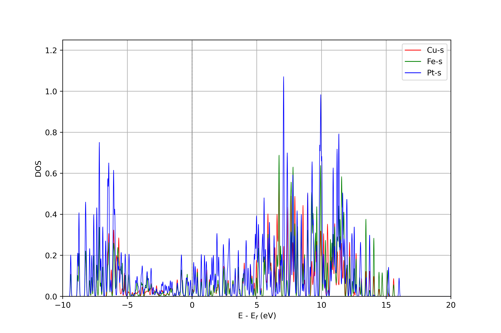

Description of the example
============================================================================
This example demonstrates the postprocessing tools (bandstructure, density of states (DOS) and partial density of states (PDOS)) of electronic structure calculations in DFT-FE. The system under consideration is a unit cell of FeCuPt<sub>2</sub> (FCC) crystal with periodic boundary conditions.

Dependencies
============================================================================
Following are the dependencies for postprocessing in python,

- pyprocar (6.2.1) (https://github.com/romerogroup/pyprocar/tree/v6.2.1)
- periodictable (1.7.0) (https://github.com/pkienzle/periodictable/tree/v1.7.0)
- yattag (1.15.2) (https://github.com/leforestier/yattag/tree/v1.15.2)
- scipy (1.11.3) (https://github.com/scipy/scipy/tree/v1.11.3)


Below we provide a step by step procedure, that includes getting the required output files from DFT-FE and steps for post processing the data obtained. To setup input files and the detailed description of the parameters in it, the reader can refer the demo examples at https://github.com/dftfeDevelopers/dftfe/tree/publicGithubDevelop/demo.

Steps
============================================================================
1. Perform a ground state calculation on the given cell geometry and coordinates (see "feCuPt2.scf.prm"). In the parameter file, "SAVE RHO DATA" should be set to "true" for to perform subsequent NSCF calculations.
2. To obtain the bandstructure, perform an NSCF calculation with a specified k-points path. (see "kpointRuleFile.inp", "feCuPt2.nscf_bands.prm") (set "LOAD RHO DATA" and "WRITE BANDS" parameters to be "true") (Refer https://www.materialscloud.org/work/tools/seekpath to generate the kpath) 
3. For DOS and/or PDOS data, perform an NSCF calculation with a refined k-point mesh. (see "feCuPt2.nscf_pdos.prm") (Set "WRITE DENSITY OF STATES", "WRITE PROJECTED DENSITY OF STATES" and "LOAD RHO DATA" parameters to be "true")
4. For the postprocessing task, follow the below steps,
   1. For both of the postprocessing tasks, first download the "postprocessModules.py" using "wget" with the url "https://github.com/dftfeDevelopers/dftfe/blob/publicGithubDevelop/postProcessing/postprocessModules.py".
   2. Create a file similar to "postprocessDemo.py", given in this repository, and edit it following the below instructions,
      - For bandstructure,  
            - Create an instance of "Plotters" class for bandstructure with the parameters described in the "postprocessDemo.py"    
            - Call the function "Plotters.plotBandStr()"
      - For DOS and/or PDOS,  
            - Create an instance of "Plotters" class for DOS and/or PDOS with the parameters described in the "postprocessDemo.py"   
            - Call the function "Plotters.plotDos()"
   5. Finally to get the plots, the python file "postprocessDemo.py" can be executed with the command "python postprocessDemo.py".


 Please take note of the below points for postprocessing,   
 
      * In the file containing kpoint rule ("kpointRuleFile.inp"), mention the name of the kpoint 
        right after the weight of the corresponding kpoint preceeded by ’#’, e.g,      
      ```
      0.0000000000 0.0000000000 0.0000000000 1 #GAMMA
      0.0000000000 0.5000000000 0.5000000000 1 #R|M
      ```
      * File named ”fermiEnergy.out”, which contains the Fermi energy in Hartree units, should be there
        in the path where the other required files are present. ”fermiEnergy.out” is generated
        automatically from "GS" calculation in DFT-FE.

<p align="center">
    
    
</p>
<p align="center">
    <span>Figure 1: Bandstructure of FeCuPt<sub>2</sub> (spin up) &nbsp;&nbsp;&nbsp;&nbsp;&nbsp;&nbsp;&nbsp;&nbsp;&nbsp;&nbsp;&nbsp;&nbsp;&nbsp;&nbsp;&nbsp;&nbsp;&nbsp;&nbsp;&nbsp;&nbsp;&nbsp;&nbsp;&nbsp;&nbsp;</span>
    <span>&nbsp;&nbsp;&nbsp;&nbsp;Figure 2: Bandstructure of FeCuPt<sub>2</sub> (spin down)</span>
</p>

<p align="center">
    
    
</p>

<p align="center">
    <span>Figure 3: Total DOS of FeCuPt<sub>2</sub> (spin up)
       &nbsp;&nbsp;&nbsp;&nbsp;&nbsp;&nbsp;&nbsp;&nbsp;&nbsp;&nbsp;&nbsp;&nbsp;&nbsp;&nbsp;&nbsp;&nbsp;&nbsp;&nbsp;&nbsp;&nbsp;&nbsp;&nbsp;&nbsp;&nbsp;</span>
    <span>&nbsp;&nbsp;&nbsp;&nbsp;Figure 4: PDOS of Cu(s), Pt(s) (spin up)</span>
</p>

<p align="center">
    
    
</p>

<p align="center">
    <span>Figure 5: PDOS of Pt(s, p, d) (spin up)
       &nbsp;&nbsp;&nbsp;&nbsp;&nbsp;&nbsp;&nbsp;&nbsp;&nbsp;&nbsp;&nbsp;&nbsp;&nbsp;&nbsp;&nbsp;&nbsp;&nbsp;&nbsp;&nbsp;&nbsp;&nbsp;&nbsp;&nbsp;&nbsp;</span>
    <span>&nbsp;&nbsp;&nbsp;&nbsp;Figure 6: PDOS of Fe(s), Cu(s), Pt(s) (spin up)</span>
</p>
