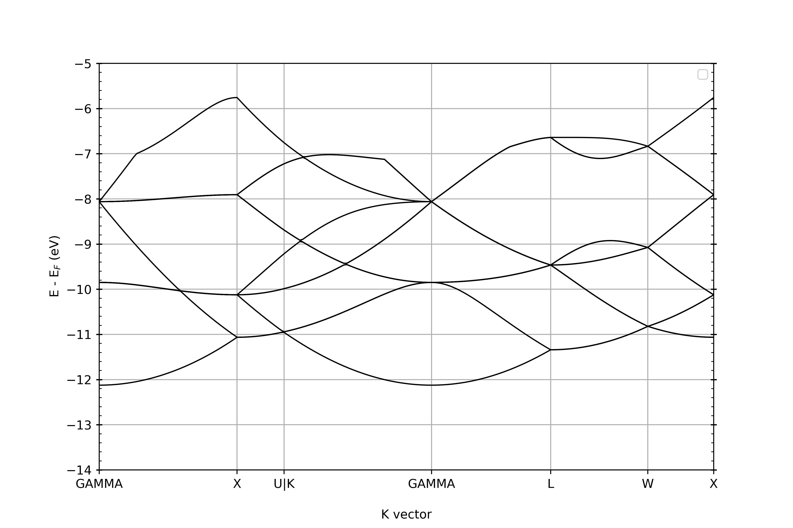
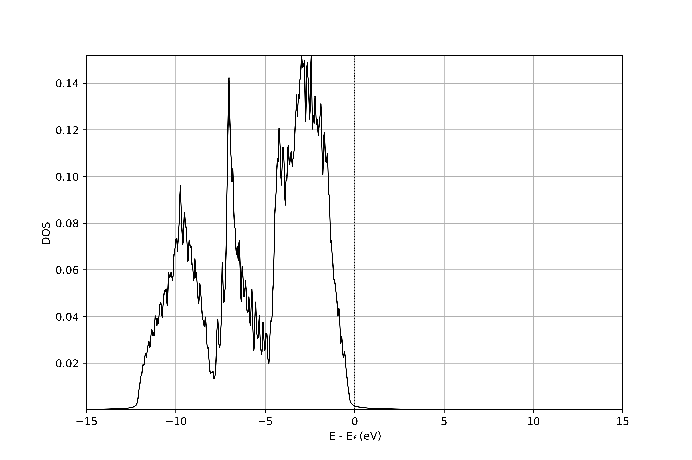

Description of the example
============================================================================
This example demonstrates the postprocessing tools (bandstructure and density of states (DOS)) of electronic structure calculations in DFT-FE. The system under consideration is a 2x2x2 supercell of Si crystal with periodic boundary conditions.

Dependencies
============================================================================
Following are the dependencies for postprocessing in python,

- pyprocar (6.1.6) (https://github.com/romerogroup/pyprocar/tree/v6.1.6)
- periodictable (1.7.0) (https://github.com/pkienzle/periodictable/tree/v1.7.0)
- yattag (1.15.2) (https://github.com/leforestier/yattag/tree/v1.15.2)
- scipy (1.11.3) (https://github.com/scipy/scipy/tree/v1.11.3)


Below we provide a step by step procedure, that includes getting the required output files from DFT-FE and steps for post processing the data obtained. To setup input files and the detailed description of the parameters in it, the reader can refer the demo examples at https://github.com/dftfeDevelopers/dftfe/tree/publicGithubDevelop/demo.

Steps
============================================================================
1. Perform a ground state calculation on the optimized cell geometry and coordinates (see "si.scf.prm"). In the parameter file, "SAVE RHO DATA" should be set to "true" for to perform subsequent NSCF calculations.
2. To obtain the band structure, perform an NSCF calculation with a specified k-points path. (see "kpointRuleFile.inp", "si.nscf_bands.prm") (set "LOAD RHO DATA" and "WRITE BANDS" parameters to be "true") (Refer https://www.materialscloud.org/work/tools/seekpath to generate the kpath) 
3. For DOS data, perform an NSCF calculation with a refined k-point mesh. (see "si.nscf_dos.prm") (Set both "WRITE DENSITY OF STATES" and "LOAD RHO DATA" parameters to be "true")
4. For the postprocessing task, create a file similar to "bandsPlotDemo.py", given in this repository and edit it following the below instructions,
   1. For both of the postprocessing tasks, first download the "postprocessModules.py" using "wget" with the url "https://raw.githubusercontent.com/dftfeDevelopers/dftfe/publicGithubDevelop/postProcessing/postprocessModules.py".
   2. Next is to create an instance of "Plotters" class with the parameters described in the "bandsPlotDemo.py", followed by calling the corresponding function.
   3. Finally to get the plots, the python file can be executed with the command "python bandsPlotDemo.py".


   Please take note of the below points for postprocessing,
   
      * In the file containing kpoint rule (kpointRuleFile.inp), mention the name of the kpoint right after the weight of the corresponding kpoint preceeded by ’#’, e.g,
      ```
      0.5000000000 0.0000000000 0.5000000000 1 #X
      0.6250000000 0.2500000000 0.6250000000 1 #U|K
      ```
      * File named ”fermiEnergy.out” (generated automatically from "GS" calculation in DFT-FE), which conatins the fermi eneergy in Hartree, should be there in the path where the other required files are present.
      
      

      <p align="center">
        
        <br>
        <p align="center">
          Figure 1: Bandstructure of Si 2&times2&times2 supercell
        </p>
      </p>
      
      
      <p align="center">
        
        <br>
        <p align="center">
          Figure 2: DOS of Si 2&times2&times2 supercell
        </p>
      </p>
