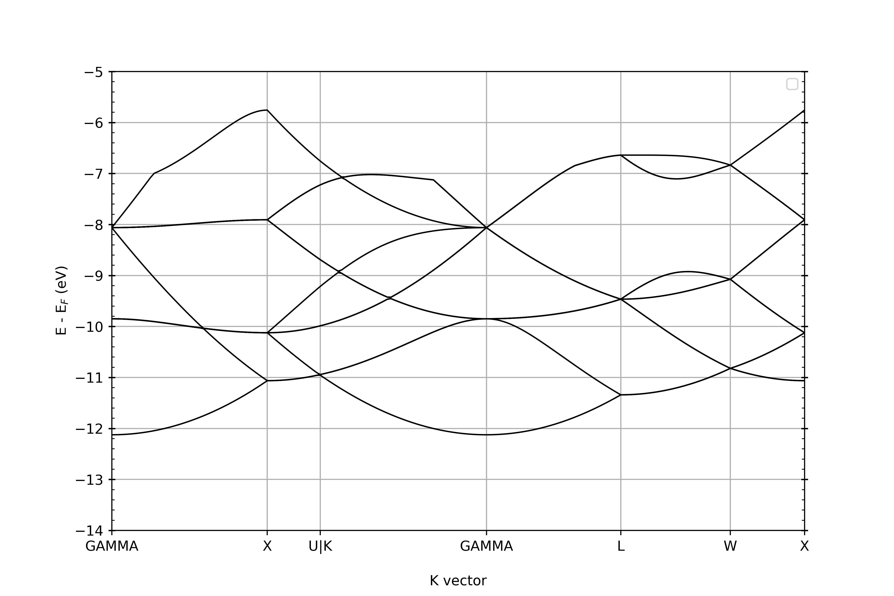
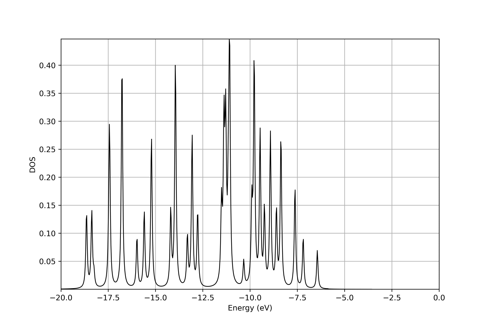

Following are the dependencies for postprocessing in python,

- pyprocar (6.1.6)
- periodictable (1.6.1)
- yattag (1.15.2)
- scipy (1.11.3)

For any of the postprocessing task, first append the path of DFT-FE to your system path.
```
sys.path.append(<path of DFTFE>)
```

bandstructure
============================================================================

Below listed files are required for plotting bandstructure,

* File containing the bandstructure data
* File containing the kpoints data
* File containing the coordinates data
* File containing the domain lattice vectors data

In addition, a file named ”fermiEnergy.out”, containing the fermi energy (in Ha), should be there in the same directory.

In the file containing the kpoint rule, mention the name of the kpoint right after the weight of the corresponding kpoint preceeded by ’#’, e.g,

```
0.5000000000 0.0000000000 0.5000000000 1 #X
0.6250000000 0.2500000000 0.6250000000 1 #U|K
```

To plot bandstructure,import and create an instance of ”Plotters” class and finally call the corresponding function.
```
plotter = Plotters(...)
plotter.plotBandStr()
```
<p align="center">
  
  <br>
  <p align="center">
    Figure 1: Bandstructure of Si 2&times2&times2 supercell
  </p>
</p>
  
DOS
============================================================================
In addition to the files listed above for plotting bandstructure, the files containing the DOS data and pseudopotential file (pseudo.inp) are required for plotting DOS.

To plot DOS,import and create an instance of ”Plotters” class and finally call the corresponding function.
```
plotter = Plotters(...)
plotter.plotDOS()
```


<p align="center">
  
  <br>
  <p align="center">
    Figure 2: DOS of Si 2&times2&times2 supercell
  </p>
</p>

