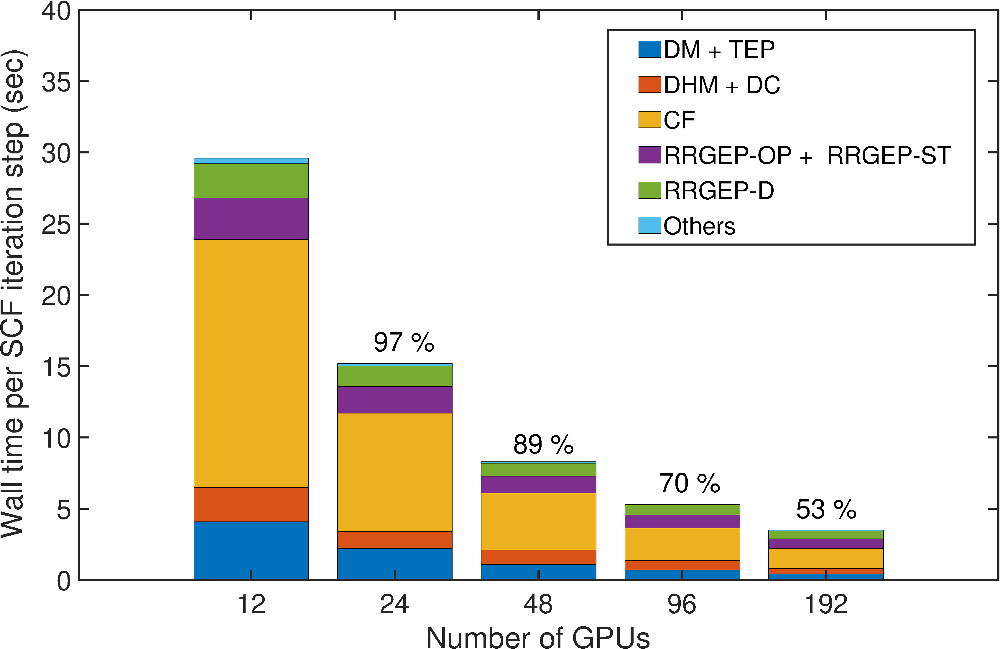
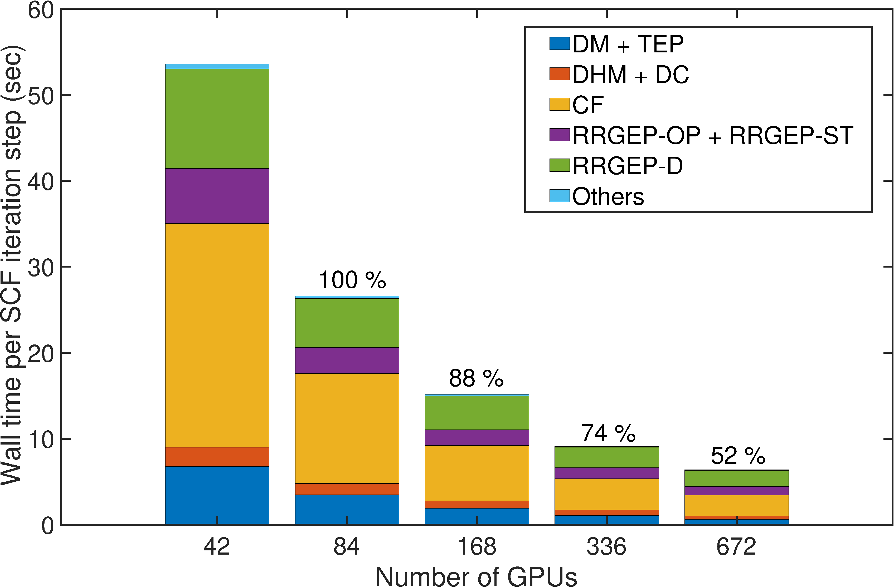

This directory contains performance benchmarks for the DFT-FE code on various medium and large-scale benchmark systems. The performance of the benchmark systems will be tracked as the architectures evolve (upcoming exascale machines) and methodology and implementation enhancements in future DFT-FE versions while maintaining the same accuracy. Additional performance benchmarks will also be added in the future as new capabilites are added into DFT-FE for example hybrid exchange-correlation functionals, time-dependent DFT, enriched finite-elements for large-scale all-electron calculations etc. The input and output files for all performance benchmarks are provided in the corresponding folders. The file structure from the top-down follows the following order  DFT-FE version-> Architecture -> Type of electronic-stucture calculation -> Nature of performance benchmarks -> different material systems. 

Performance benchmarks for pseudopotential DFT ground-state calulations
==================================================================================
All benchmark calculations are run using ONCV pseudopotentials and finite-element discretization parameters are commensurate with chemical accuracy (~1e-4 Ha/atom in ground-state energy, ~1e-4 Ha/Bohr in ionic forces and ~5e-6 Ha/Bohr^3 in cell stresses). 

Architectures used for the benchmarks:
-------------
i. OLCF Summit: 6 NVIDIA V100 GPUs and 2 IBM POWER9 CPUs (42 cores total) per node
  

Computational cost benchmarks
--------------

| Material System  	     | Number of atoms (No. of electrons) | Number of Nodes (GPUs) | Total wall time (Hrs) | Average wall-time per SCF (Hrs) | CPU-GPU speedup |  kPoints |
| ---------------------------| ---------------------------------- | ---------------------- | --------------------- | --------------------------------| --------------- |----------|
| BCC Mo6x6x6 Monovacancy    |            431 (6034)              |	  4 (24)	   |       0.093           |     	  0.0037             |      13.7       |  Gamma   |
| BCC Mo8x8x8 Monovacancy    |           1023 (14,322)            |      14 (84)	   |       0.15            |	          0.006	             |      17.3       |  Gamma   |
| BCC Mo10x10x10 Monovacancy |           1999 (27,986)            |	 40 (240)	   |       0.235           |              0.0094             |      18.0       |  Gamma   |
| BCC Mo6x6x6 Monovacancy    |            431 (6034)              |	 40 (240)	   |	   0.124  	   |		  0.0049             |      22.1       |  2x2x2   |                                   
| Al 7Shell Nanoparticle     |	         1415 (4245)              |	 20 (120)          |       0.227           |              0.0032             |      17.2       |    -     |
| Al 12Shell Nanoparticle    | 		 6525 (19,575)		  |	190 (1140)         |       1.485           |              0.0074             |      19.3       |    -     |
| BCC Mo13x13x13 Monovacancy |           4393 (61,502)            |	160 (960)	   |	   0.535           |		  0.0218	     |       -         |  Gamma   |                                       
| BCC Mo16x16x16 Monovacancy |           8191 (114,674)           |     600 (3600)         |       0.9             |              0.036              |       -         |  Gamma   |

Strong parallel scaling
-----------

Strong parallel scaling of wall-time per SCF iteration step on OLCF Summit GPU nodes. Please refer to (arxiv paper link) for details on the breakdown of the wall-time into various computational steps.

BCC Mo6x6x6 monvacancy  (431 atoms, 6,034 electrons---Gamma point)            |  BCC Mo8x8x8 monvacancy (1,023 atoms, 14,322 electrons---Gamma point)
:-------------------------:|:-------------------------:
  |  

Minimum wall-time
--------------

Minimum total run wall-time including initialization costs and computation of ionic forces achieved on OLCF Summit GPU nodes at a parallel scaling efficiency of around 40 %

| Material System        | Number of atoms (No. of electrons) | k-points | Number of Nodes (GPUs) | Total wall time (sec)| 
| ----------------       | ---------------------------------- | ---------| ---------------------- |----------------------| 
| BCC Mo6x6x6 monvacancy |  431 (6,034)                       |	Gamma  |        64 (384)          |        82.5          |     		      
| BCC Mo8x8x8 monvacancy |  1,023 (14,322)                    |	Gamma  |       224 (1,344)        |        140.2         |			      
